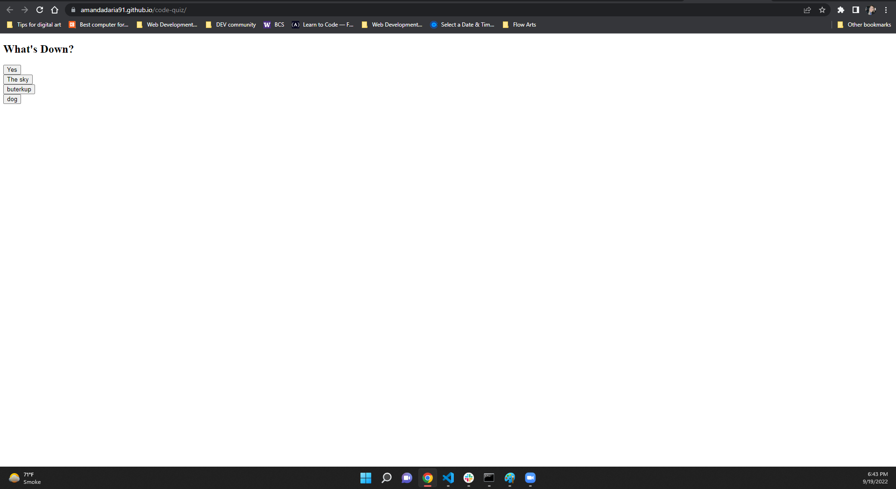

# code-quiz

## Description

A fun quiz I built which flips through questions on the same page. This is still a work in progress, but I am going to add a score page to show a high score from the quiz, the quiz will also be timed. 

- My motivation for this project was to practice using Javascript.
- I built this project because I believe that it will help build foundational skills that be diverse in different situations while building website.
- This problem solves an efficient way to make a quiz. 
- I learned how to use JavaScript and apply it to a real world situation. 

## Table of Contents

- [Installation](#installation)
- [Usage](#usage)
- [Credits](#credits)
- [License](#license)
- [Badges](#badges)

## Installation

No installation or authentication required to view the webpage. 

## Usage

[Link to deployed site](https://amandadaria91.github.io/code-quiz/)

## Credits

@UWA-Bootcamp provided instruction into the foundational knowledge of HTML, CSS, and JavaScript. 

## License

I used an [MIT License](LICENSE).

## Badges

